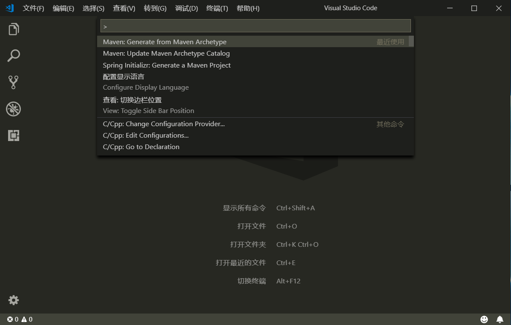
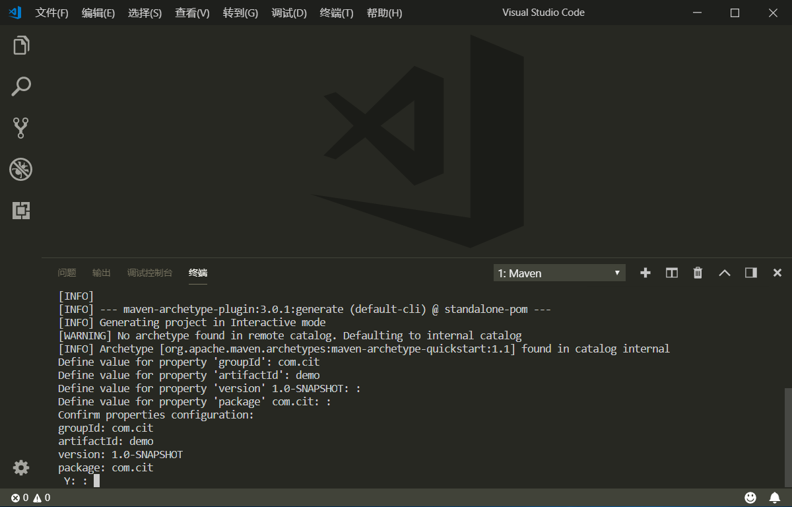
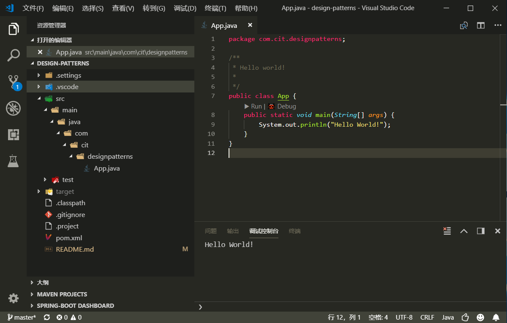

# design-patterns
设计模式(Maven工程，VS Code搭建Java开发环境)

安装VS Code相关插件
Language support for Java ™ for Visual Studio Code
Java Extension Pack
Debugger for Java
Java Test Runner
Maven for Java

### 1.创建Maven项目(Ctrl+Shift+P)

### 2.输入项目信息

### 3.点击main函数上的Run或Debug

